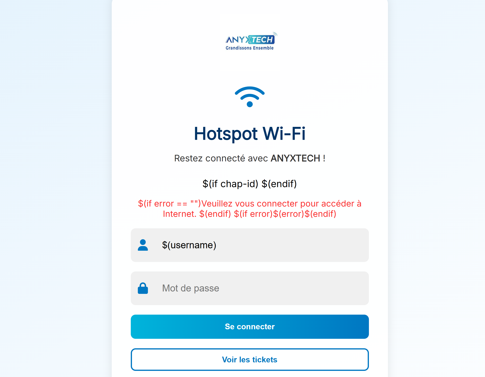

# 🔐 HotspotYamd

**HotspotYamd** est un portail captif personnalisable conçu pour les réseaux Wi-Fi publics. Il permet aux utilisateurs de se connecter à Internet après avoir payé via FedaPay, TicketWifi ou d'autres solutions de paiement.

## 📌 Fonctionnalités

- Interface de connexion moderne avec design responsive
- Intégration de paiement :
  - ✅ [FedaPay](https://fedapay.com)
  - ✅ [TicketWifi](https://ticketwifi.com)
- Génération dynamique d'accès Wi-Fi via **MikroTik Userman API**
- Redirection automatique après paiement
- Support multi-profils (5h, 24h, 3j, 7j, 30j)
- Page d’affichage des identifiants après achat
- Code facilement adaptable (HTML, CSS, JS + PHP)

---

## ⚙️ Prérequis

- Un routeur **MikroTik** configuré avec **Hotspot** et **User Manager**
- Un serveur web (Apache/Nginx) avec PHP 7+
- Accès FedaPay (mode Sandbox ou production)
- Compte TicketWifi (si utilisé)
- Nom de domaine (optionnel mais recommandé)

---

## 🗂 Structure du projet

```bash
HotspotYamd/
├── login.html              # Page de connexion principale
├── tickets.html            # Sélection des tickets
├── create-access.php       # Création dynamique des accès via l'API MikroTik
├── ticket.html             # Affichage des identifiants après achat
├── routeros_api.class.php  # Bibliothèque d'accès à l'API MikroTik
├── style.css               # Feuille de style globale
├── assets/                 # Images et icônes (wifi, logo, etc.)
🚀 Installation
Cloner le dépôt :

bash
Copier
Modifier
git clone https://github.com/yamdev07/HotspotYamd.git
cd HotspotYamd
Configurer les fichiers :

create-access.php : mets l’IP du MikroTik, le login/mot de passe, et les noms de profils.

ticket.html : personnalise l’affichage.

tickets.html : insère tes liens FedaPay / TicketWifi.

Déployer sur ton serveur :

Copie les fichiers dans /var/www/html (ou autre dossier web).

Assure-toi que le MikroTik autorise l’accès à l’API.

📸 Aperçu



🔐 Sécurité
Pense à désactiver l'accès à routeros_api.class.php depuis l’extérieur.

Active un firewall sur ton serveur.

Utilise HTTPS sur ton portail.

🤝 Contributions
Les contributions sont les bienvenues ! Fork le projet, propose des améliorations ou corrige des bugs.

🧑‍💻 Auteur
Yoann Yamd – @yamdev07
Projet développé pour les besoins d'accès Wi-Fi sécurisé avec paiement.

